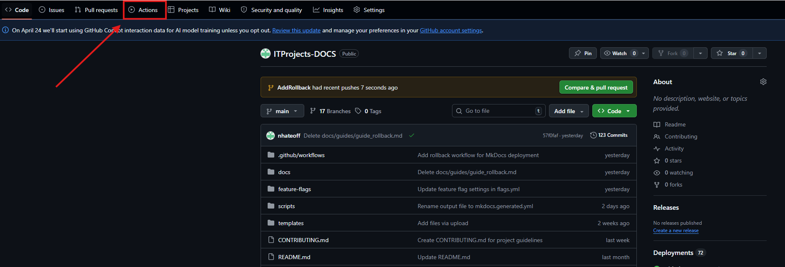
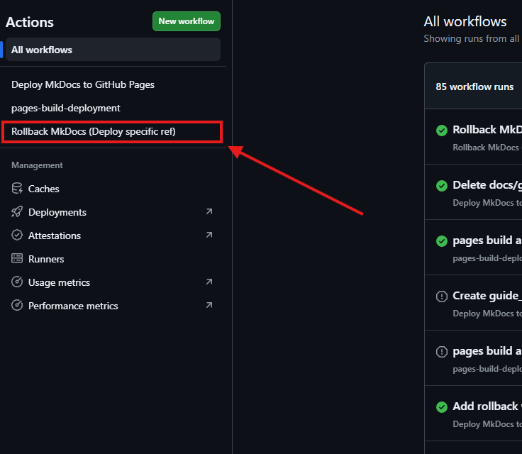
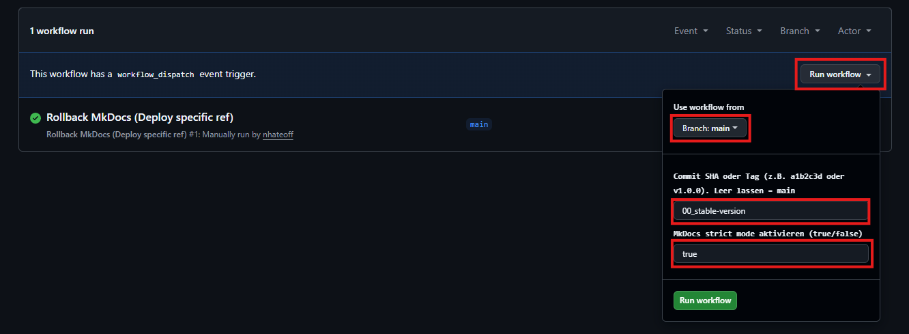

# Anleitung: Wie bediene ich einen Rollback, wenn die MkDocs korrupt ist?
Das hier ist eine kurze step by step Anleitung, um korrekt zur stable-version bzw. zum bisherigen "Last good known" zurückzukehren. 

## Step 1
Navigiere im Reiter auf **Actions**.

## Step 2
In der linken Sidebar sind drei benutzerdefinierte Workflows aufzufinden. Wähle hier **"Rollback MkDocs (Deploy specific ref)"** aus.

## Step 3
Es öffnet sich nun die Workflow-Übersicht. Wähle hierzu **Run workflow** aus. Danach muss die Branch **main** ausgewählt werden.
Im nächsten Feld kann grundsätzlich eine beliegebe Commit SHA/Tag ausgewählt werden. Hier verwenden wir jetzt **00_stable-version**
*Hinweis: sctrict mode sollte idealerweise auf **true** bleiben.*

Owner: @nhateoff
Last reviewed: 05.04.2026
